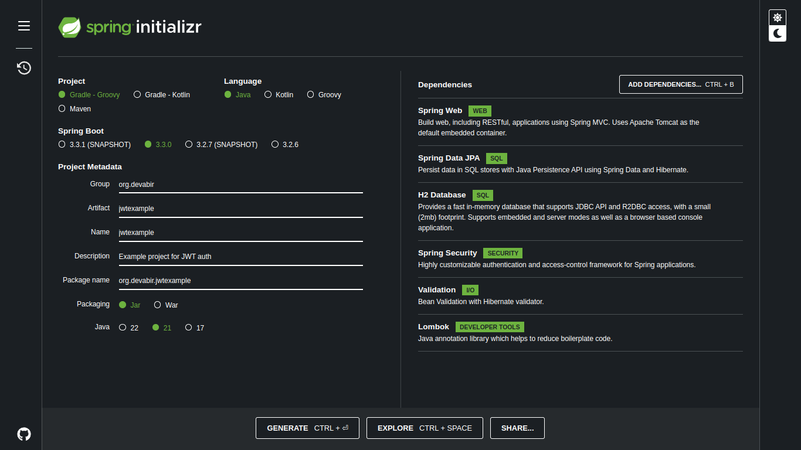
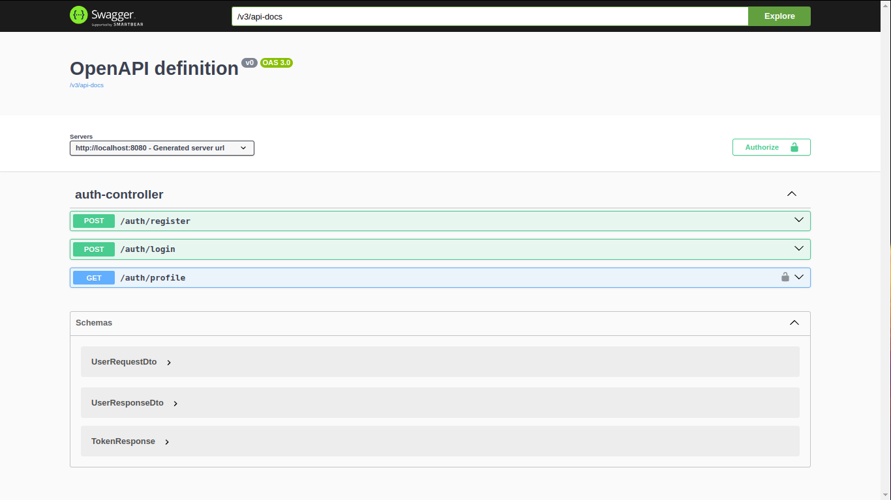
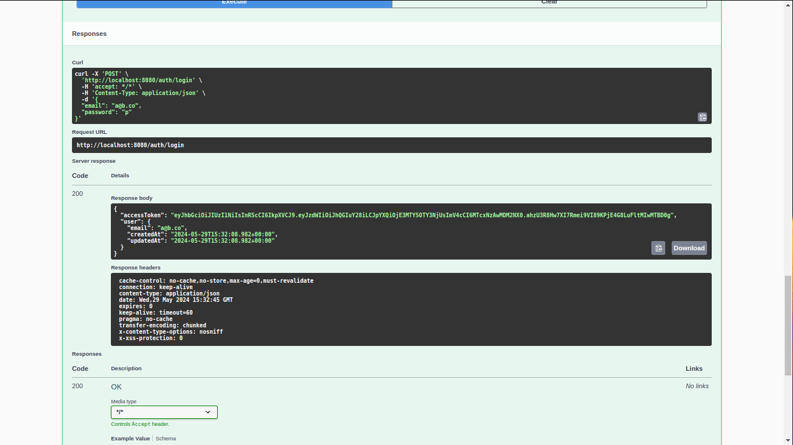
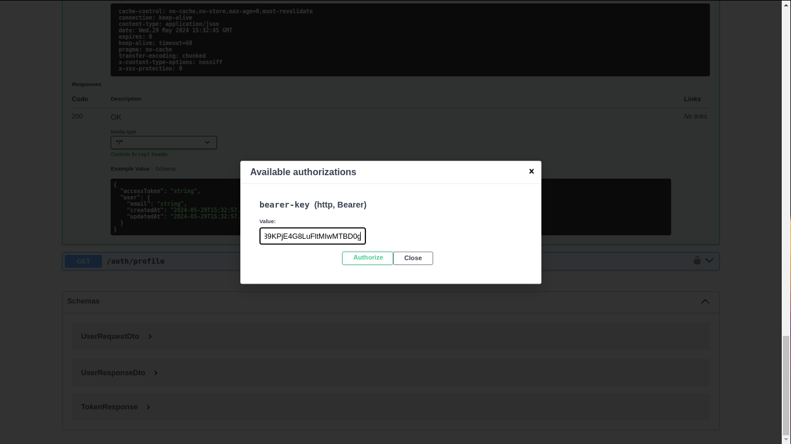
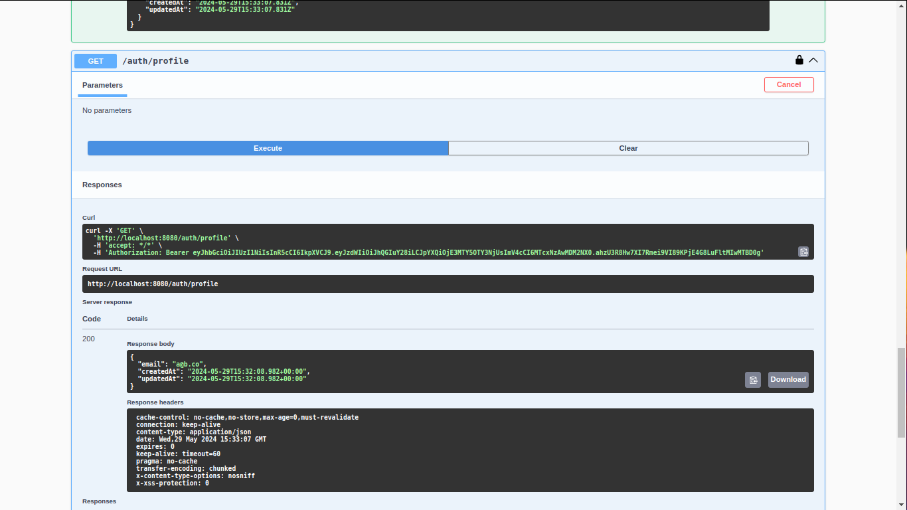
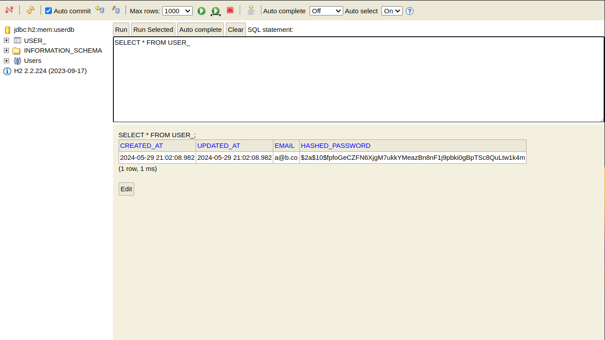

# Why?

This is yet-another-spring-boot-jwt-tutorial. It has 2 main motives:

- To understand and document my understanding about spring security.
- The existing articles mostly use [jjwt](https://github.com/jwtk/jjwt) which has
  a [vulnerable release](https://mvnrepository.com/artifact/io.jsonwebtoken/jjwt-impl/0.12.5) (as of now). Thus, I
  decided to use an alternative library, along with [springdoc openapi 3 swagger](https://springdoc.org/) docs.

> Probably you could scavenge the internet, and use LLMs to put up such an implementation. I just created a _cookbook_
> kind of, you may use it as a guide.

Let's start...

# How?

This is not at all a beginner's guide, and I would assume the reader knows the basics of spring, IOC container, gradle, spring
data JPA, how to build basic CRUD in spring boot.
As a starting point, you may follow [this guide](https://spring.io/guides/gs/rest-service).

## Initialize

This is a simple CRUD application with just 3 routes: `/register`, `/login` and `/profile` (protected route). I hope
this is pretty much self-explanatory. We will be using the [H2 database](https://www.h2database.com/html/main.html), which is an in-memory database. It is easy to deal with during development, **but not ideal for production.** There's also an inbuilt web UI for H2 database.

Go to [Spring boot initializr](https://start.spring.io/).\
You will need the following dependencies:

```groovy
dependencies {
    implementation 'org.springframework.boot:spring-boot-starter-data-jpa'
    implementation 'org.springframework.boot:spring-boot-starter-security'
    implementation 'org.springframework.boot:spring-boot-starter-validation'
    implementation 'org.springframework.boot:spring-boot-starter-web'
    implementation 'com.auth0:java-jwt:4.4.0'
    implementation 'org.springdoc:springdoc-openapi-starter-webmvc-ui:2.5.0'
    compileOnly 'org.projectlombok:lombok'
    runtimeOnly 'com.h2database:h2'
    annotationProcessor 'org.projectlombok:lombok'
    testImplementation 'org.springframework.boot:spring-boot-starter-test'
    testImplementation 'org.springframework.security:spring-security-test'
    testRuntimeOnly 'org.junit.platform:junit-platform-launcher'
}
```

> The above alien language is groovy, which is used to configure Gradle build system (similar to xml in maven). The
> dependencies block is straightforward and pretty self-explanatory (one of the reasons why I prefer Gradle).

Now, extract and import the gradle/maven project into your preferred editor. If any error occurs, make sure about *
*spring and java version.**

Two dependencies (`com.auth0:java-jwt` and `org.springdoc:springdoc-openapi-starter-webmvc-ui`) aren't available in
spring starter. Get them from [here](https://mvnrepository.com/artifact/com.auth0/java-jwt)
and [here](https://mvnrepository.com/artifact/org.springdoc/springdoc-openapi-starter-webmvc-ui).



## Model

We will first create our model, then controller, then service, in the meantime, we will also learn about the required
things as we go along...

1. Create a package called `controller`.
2. Create `UserDao.java`:
    ```java
    package org.devabir.jwtexample.model;
    
    import jakarta.persistence.Column;
    import jakarta.persistence.Entity;
    import jakarta.persistence.Id;
    import jakarta.persistence.Table;
    import lombok.AllArgsConstructor;
    import lombok.Data;
    import lombok.NoArgsConstructor;
    import org.hibernate.annotations.CreationTimestamp;
    import org.hibernate.annotations.UpdateTimestamp;
    
    import java.util.Date;
    
    @Entity
    @Table(name = "user_")
    @Data
    @AllArgsConstructor
    @NoArgsConstructor
    public class UserDao {
    
        @Id
        private String email;
    
        @Column(nullable = false, name = "hashed_password")
        private String hashedPassword;
    
        @CreationTimestamp
        @Column(name = "created_at", updatable = false, nullable = false)
        private final Date createdAt = new Date();
    
        @UpdateTimestamp
        @Column(name = "updated_at")
        private Date updatedAt;
    
    }
    ```

   This is for interacting with the database. Most db has `user` as reserved keyword, hence, we are calling it `user_`.\
   > Getters, setters, and constructors are all **auto-generated by the annotations from lombok**. If you are new to
   this, you should spend some time and [setup lombok in your ide](https://projectlombok.org/setup/).

3. Create `UserRequestDto.java`:
    ```java
    package org.devabir.jwtexample.model;
    
    import jakarta.validation.constraints.Email;
    import jakarta.validation.constraints.NotBlank;
    import lombok.AllArgsConstructor;
    import lombok.Data;
    import lombok.NoArgsConstructor;
    
    @Data
    @AllArgsConstructor
    @NoArgsConstructor
    public class UserRequestDto {
    
        @NotBlank(message = "Email is mandatory.")
        // This email regex works. Trust me :)
        @Email(message = "Please enter a valid email.", regexp = "^[a-zA-Z0-9_!#$%&’*+/=?`{|}~^.-]+@[a-zA-Z0-9.-]+$")
        private String email;
    
        @NotBlank(message = "Password is mandatory.")
        private String password;
    
    }
    ```
   It also has **validation logic**. The email regex is sourced from some online searches, and it will work every time (trust me :)).

4. Create `UserResponseDto.java`:
    ```java
    package org.devabir.jwtexample.model;
    
    import lombok.AllArgsConstructor;
    import lombok.Data;
    import lombok.NoArgsConstructor;
    
    import java.util.Date;
    
    @Data
    @AllArgsConstructor
    @NoArgsConstructor
    public class UserResponseDto {
    
        private String email;
        private Date createdAt;
        private Date updatedAt;
    
    }
    ```
   Separate Response object, so that we **don't accidentally leak out confidential attributes** like password, also it
   includes generated fields like created and updated timestamp.

5. Create `TokenResponse.java`:
    ```java
    package org.devabir.jwtexample.model;
    
    import lombok.AllArgsConstructor;
    import lombok.Data;
    import lombok.NoArgsConstructor;
    
    @Data
    @AllArgsConstructor
    @NoArgsConstructor
    public class TokenResponse {
    
        private String accessToken;
        private UserResponseDto user;
    
    }
    ```
   This class will be specifically used to respond on a `/login` request. We will not only send the user info, but also
   the
   **JWT access token**. In later sections, we will see how to set up the JWT part.

This is all about the models, now let's set up the repository for interacting with the database.

## JPA Repository

Create a package called `repository`, then inside that create `UserRepository.java`:

```java
package org.devabir.jwtexample.repository;

import org.devabir.jwtexample.model.UserDao;
import org.springframework.data.jpa.repository.JpaRepository;

public interface UserRepository extends JpaRepository<UserDao, String> {
}
```

## Controller

We have only one controller. Create a package `controller`, inside that a file `AuthController.java`:

```java
package org.devabir.jwtexample.controller;

import io.swagger.v3.oas.annotations.Operation;
import io.swagger.v3.oas.annotations.security.SecurityRequirement;
import jakarta.validation.Valid;
import org.devabir.jwtexample.model.TokenResponse;
import org.devabir.jwtexample.model.UserRequestDto;
import org.devabir.jwtexample.model.UserResponseDto;
import org.devabir.jwtexample.service.AuthService;
import org.devabir.jwtexample.service.JwtService;
import org.springframework.http.HttpStatus;
import org.springframework.http.ResponseEntity;
import org.springframework.security.core.Authentication;
import org.springframework.security.core.context.SecurityContextHolder;
import org.springframework.security.core.userdetails.UserDetails;
import org.springframework.web.bind.annotation.*;

@RestController
@RequestMapping("/auth")
public class AuthController {

    private final AuthService authService;
    private final JwtService jwtService;

    public AuthController(AuthService authService, JwtService jwtService) {
        this.authService = authService;
        this.jwtService = jwtService;
    }

    @PostMapping("/register")
    public ResponseEntity<UserResponseDto> register(@Valid @RequestBody UserRequestDto userRequestDto) {
        return ResponseEntity
                .status(HttpStatus.CREATED)
                .body(this.authService.register(userRequestDto));
    }

    @PostMapping("/login")
    public ResponseEntity<TokenResponse> login(@Valid @RequestBody UserRequestDto userRequestDto) {
        UserResponseDto user = authService.login(userRequestDto);
        final String accessToken = jwtService.buildToken(user.getEmail());
        return ResponseEntity.ok(new TokenResponse(accessToken, user));
    }

    @Operation(security = {@SecurityRequirement(name = "bearer-key")})
    @GetMapping("/profile")
    public ResponseEntity<UserResponseDto> profile() {
        Authentication authentication = SecurityContextHolder.getContext().getAuthentication();
        UserDetails userDetails = (UserDetails) authentication.getPrincipal();
        final String email = userDetails.getUsername();
        return ResponseEntity.ok(this.authService.profile(email));
    }

}
```

- This controller has 2 dependencies, `AuthService` and `JwtService`. We will eventually implement them.
- This controller will give us a high-level overview of the API we are going to create.
- `@Valid` annotation will validate the Bean with the constraints like `@NotBlank`, defined earlier, and throw an
  appropriate error. Spring's default exception
  handler [ProblemDetailsExceptionHandler](https://github.com/spring-projects/spring-boot/blob/main/spring-boot-project/spring-boot-autoconfigure/src/main/java/org/springframework/boot/autoconfigure/web/servlet/ProblemDetailsExceptionHandler.java),
  will respond with an appropriate JSON.
- `@Operation(security = {@SecurityRequirement(name = "bearer-key")})` annotation is specific to springdoc, we will come
  to it at last. Just remember that it helps us to identify which routes require authentication in the generated docs.
- ```java 
  Authentication authentication = SecurityContextHolder.getContext().getAuthentication();
  UserDetails userDetails = (UserDetails) authentication.getPrincipal();
  final String email = userDetails.getUsername();
  ```
  In English, this approximately translates to: _"If the user is authenticated, Spring should already have the authenticated
  user's data, which we are simply accessing."_ Keep this part in mind, we will again use these when setting up security
  configs.

## Service

1. Create a package called `service`.
2. Create `UserService.java`:
    ```java
    package org.devabir.jwtexample.service;
    
    import org.devabir.jwtexample.model.UserDao;
    import org.devabir.jwtexample.model.UserResponseDto;
    import org.springframework.beans.BeanUtils;
    import org.springframework.stereotype.Service;
    
    @Service
    public class UserService {
    
        public UserResponseDto toDto(UserDao userDao) {
            UserResponseDto result = new UserResponseDto();
            BeanUtils.copyProperties(userDao, result, "hashedPassword");
            return result;
        }
    
    }
    ```
    - This file only converts the DAO to DTO, thus adhering to separation-of-concerns.
    - DTO and DAO have many common fields, thus we are copying the Bean properties. There are other methods like
      model-mapper, builder or constructor from lombok. This seemed short and simple enough.
      ```java
      public static void copyProperties(
      Object source,
      Object target,
      String... ignoreProperties) throws BeansException {}
      ```
      This would work, even if you just omit the last parameter, I just included that to be explicit.

3. Create `JwtService.java`:
    ```java
    package org.devabir.jwtexample.service;

    import com.auth0.jwt.JWT;
    import com.auth0.jwt.algorithms.Algorithm;
    import com.auth0.jwt.exceptions.JWTVerificationException;
    import com.auth0.jwt.interfaces.DecodedJWT;
    import com.auth0.jwt.interfaces.JWTVerifier;
    import org.springframework.beans.factory.annotation.Value;
    import org.springframework.stereotype.Service;
    
    import java.util.Date;
    
    @Service
    public class JwtService {
    
        private final long jwtExpiration;
        private final Algorithm signingAlgorithm;
    
        public JwtService(
                @Value("${security.jwt.secret-key}") String secretKey,
                @Value("${security.jwt.expiration-time}") long jwtExpiration
        ) {
            this.jwtExpiration = jwtExpiration;
            this.signingAlgorithm = Algorithm.HMAC256(secretKey);
        }
    
        public String extractEmail(String token) {
            JWTVerifier jwtVerifier = JWT.require(signingAlgorithm).build();
            DecodedJWT jwt = jwtVerifier.verify(token);
            return jwt.getSubject();
        }
    
        public boolean isTokenValid(String token, String email) {
            try {
                JWTVerifier verifier = JWT.require(signingAlgorithm)
                        .withSubject(email)
                        .build();
                verifier.verify(token);
            } catch (JWTVerificationException exception) {
                return false;
            }
            return true;
        }
    
        public String buildToken(String email) {
            return JWT.create()
                    .withSubject(email)
                    .withIssuedAt(new Date())
                    .withExpiresAt(new Date(System.currentTimeMillis() + jwtExpiration))
                    .sign(signingAlgorithm);
        }
    
    }
    ```
    - This code actually uses the [Auth0's JWT library](https://github.com/auth0/java-jwt).
    - `@Value("${security.jwt.secret-key}")` imports values from the `application.properties` file.
    - This is mostly self-explanatory, we are setting user's email as the subject and signing algorithm as `HMAC256`.
    - One thing to keep in mind, `jwtVerifier.verify(token);` could throw verification error.
4. At last `AuthService.java`:
    ```java
    package org.devabir.jwtexample.service;
    
    import org.devabir.jwtexample.model.UserDao;
    import org.devabir.jwtexample.model.UserRequestDto;
    import org.devabir.jwtexample.model.UserResponseDto;
    import org.devabir.jwtexample.repository.UserRepository;
    import org.springframework.beans.BeanUtils;
    import org.springframework.http.HttpStatus;
    import org.springframework.security.authentication.AuthenticationManager;
    import org.springframework.security.authentication.UsernamePasswordAuthenticationToken;
    import org.springframework.security.core.userdetails.UsernameNotFoundException;
    import org.springframework.security.crypto.password.PasswordEncoder;
    import org.springframework.stereotype.Service;
    import org.springframework.web.server.ResponseStatusException;
    
    @Service
    public class AuthService {
    
        private final UserService userService;
        private final UserRepository userRepository;
        private final PasswordEncoder passwordEncoder;
        private final AuthenticationManager authenticationManager;
    
        public AuthService(UserService userService, UserRepository userRepository, PasswordEncoder passwordEncoder, AuthenticationManager authenticationManager) {
            this.userService = userService;
            this.userRepository = userRepository;
            this.passwordEncoder = passwordEncoder;
            this.authenticationManager = authenticationManager;
        }
    
        public UserResponseDto register(UserRequestDto userRequestDto) {
            final String email = userRequestDto.getEmail();
            if (this.userRepository.findById(email).isPresent())
                throw new ResponseStatusException(HttpStatus.CONFLICT, "Email " + email + " is already taken.");
    
            UserDao userDao = new UserDao();
            BeanUtils.copyProperties(userRequestDto, userDao, "password");
            userDao.setHashedPassword(this.passwordEncoder.encode(userRequestDto.getPassword()));
            userDao = this.userRepository.save(userDao);
            return this.userService.toDto(userDao);
        }
    
        public UserResponseDto login(UserRequestDto userRequestDto) {
            final String email = userRequestDto.getEmail();
            UserDao userDao = userRepository.
                    findById(email)
                    .orElseThrow(
                            () -> new UsernameNotFoundException("User " + email + " not found.")
                    );
    
            this.authenticationManager.authenticate(
                    new UsernamePasswordAuthenticationToken(
                            userRequestDto.getEmail(),
                            userRequestDto.getPassword()
                    )
            );
    
            return userService.toDto(userDao);
        }
    
        public UserResponseDto profile(String email) {
            UserDao userDao = userRepository
                    .findById(email)
                    .orElseThrow(() -> new UsernameNotFoundException("User " + email + " not found."));
            return userService.toDto(userDao);
        }
    
    }
    ```
    - We need to define 2 beans (`PasswordEncoder` and `AuthenticationManager`). We will define them in upcoming sections.
    - ```java
        this.authenticationManager.authenticate(
          new UsernamePasswordAuthenticationToken(
                        userRequestDto.getEmail(),
                        userRequestDto.getPassword()
                )
        );
        ```
      This will authenticate and save the user data into Spring's context.


## Config

1. Create a package called `config`.
2. Create `AppConfig.java`:
    ```java
    package org.devabir.jwtexample.config;
    
    import io.swagger.v3.oas.models.Components;
    import io.swagger.v3.oas.models.OpenAPI;
    import io.swagger.v3.oas.models.security.SecurityScheme;
    import org.devabir.jwtexample.model.UserDao;
    import org.devabir.jwtexample.repository.UserRepository;
    import org.springframework.context.annotation.Bean;
    import org.springframework.context.annotation.Configuration;
    import org.springframework.security.authentication.AuthenticationManager;
    import org.springframework.security.authentication.AuthenticationProvider;
    import org.springframework.security.authentication.dao.DaoAuthenticationProvider;
    import org.springframework.security.config.annotation.authentication.configuration.AuthenticationConfiguration;
    import org.springframework.security.core.GrantedAuthority;
    import org.springframework.security.core.userdetails.UserDetails;
    import org.springframework.security.core.userdetails.UserDetailsService;
    import org.springframework.security.core.userdetails.UsernameNotFoundException;
    import org.springframework.security.crypto.bcrypt.BCryptPasswordEncoder;
    
    import java.util.Collection;
    import java.util.List;
    import java.util.Optional;
    
    @Configuration
    public class AppConfig {
    
        private final UserRepository userRepository;
    
        public AppConfig(UserRepository userRepository) {
            this.userRepository = userRepository;
        }
    
        @Bean
        public AuthenticationManager authenticationManager(AuthenticationConfiguration authConfig) throws Exception {
            return authConfig.getAuthenticationManager();
        }
    
        @Bean
        BCryptPasswordEncoder passwordEncoder() {
            return new BCryptPasswordEncoder();
        }
    
        @Bean
        public AuthenticationProvider authenticationProvider() {
            DaoAuthenticationProvider authProvider = new DaoAuthenticationProvider();
            authProvider.setUserDetailsService(userDetailsService());
            authProvider.setPasswordEncoder(passwordEncoder());
            return authProvider;
        }
    
        @Bean
        UserDetailsService userDetailsService() {
            return new UserDetailsService() {
                @Override
                public UserDetails loadUserByUsername(String username) throws UsernameNotFoundException {
                    // NOTE: no username, we just use emails internally.
                    final String email = username;
                    Optional<UserDao> optionalUserDao = userRepository.findById(email);
                    if (optionalUserDao.isEmpty()) {
                        throw new UsernameNotFoundException("User " + email + " not found.");
                    }
                    UserDao user = optionalUserDao.get();
                    return new UserDetails() {
                        @Override
                        public Collection<? extends GrantedAuthority> getAuthorities() {
                            return List.of();
                        }
    
                        @Override
                        public String getPassword() {
                            return user.getHashedPassword();
                        }
    
                        @Override
                        public String getUsername() {
                            return user.getEmail();
                        }
                    };
                }
            };
        }
    
        @Bean
        public OpenAPI customOpenAPI() {
            return new OpenAPI()
                    .components(
                            new Components()
                                    .addSecuritySchemes(
                                            "bearer-key",
                                            new SecurityScheme()
                                                    .type(SecurityScheme.Type.HTTP)
                                                    .scheme("bearer")
                                                    .bearerFormat("JWT")
                                    )
                    );
        }
    
    }
   ```
    - This is probably the most convoluted part of our current app. Here, our business logic interfaces with spring boot framework. We will go from top to bottom.
    - The beans for `AuthenticationManager` and `PasswordEncoder` were required by the `AuthService`, we are defining it here. These will be injected into `AuthService`.
    - Spring framework can work with many `AuthenticationProvider`, like: `DaoAuthenticationProvider`, `LdapAuthenticationProvider`. Also, we can implement complex rules like different authentication providers for different routes.
    - We are defining a `DaoAuthenticationProvider`, which is very common (it uses a `UserDetailsService` to retrieve user details from the database and compare credentials).
    - This `UserDetailsService` is very spring-specific way of defining users. We need to define `loadUserByUsername(...)` to retrieve the user from Database. We can also define some authorities for role-based access control purposes. Here username is just the user's email.
    - How we will define the `UserDetails` is up to us and spring will remember that, we can access that in a protected route.
    - `customOpenAPI()` this is used to enhance the generated swagger docs. We will use this in demo later. [Source](https://springdoc.org/#how-do-i-add-authorization-header-in-requests).

3. Create `SecurityConfig.java`:
    ```java
   package org.devabir.jwtexample.config;
    
    import org.springframework.context.annotation.Bean;
    import org.springframework.context.annotation.Configuration;
    import org.springframework.security.authentication.AuthenticationProvider;
    import org.springframework.security.config.annotation.web.builders.HttpSecurity;
    import org.springframework.security.config.annotation.web.configuration.EnableWebSecurity;
    import org.springframework.security.config.http.SessionCreationPolicy;
    import org.springframework.security.web.SecurityFilterChain;
    import org.springframework.security.web.authentication.UsernamePasswordAuthenticationFilter;
    import org.springframework.web.cors.CorsConfiguration;
    import org.springframework.web.cors.CorsConfigurationSource;
    import org.springframework.web.cors.UrlBasedCorsConfigurationSource;
    
    import java.util.List;
    
    @Configuration
    @EnableWebSecurity
    public class SecurityConfig {
    
        private final AuthenticationProvider authenticationProvider;
        private final JwtAuthFilter jwtAuthFilter;
    
        public SecurityConfig(AuthenticationProvider authenticationProvider, JwtAuthFilter jwtAuthFilter) {
            this.authenticationProvider = authenticationProvider;
            this.jwtAuthFilter = jwtAuthFilter;
        }
    
        @Bean
        public SecurityFilterChain securityFilterChain(HttpSecurity httpSecurity) throws Exception {
            httpSecurity.csrf(csrf -> csrf.disable());
            httpSecurity.headers(h -> h.frameOptions(fo -> fo.disable()));
            httpSecurity.authorizeHttpRequests(
                    authorizeHttpRequests -> authorizeHttpRequests
                            .requestMatchers("/auth/profile")
                            .authenticated()
                            .anyRequest()
                            .permitAll()
            );
            httpSecurity.sessionManagement(sessionManagement -> sessionManagement.sessionCreationPolicy(SessionCreationPolicy.STATELESS));
            httpSecurity.authenticationProvider(authenticationProvider);
            httpSecurity.addFilterBefore(jwtAuthFilter, UsernamePasswordAuthenticationFilter.class);
    
            return httpSecurity.build();
        }
    
        @Bean
        CorsConfigurationSource corsConfigurationSource() {
            CorsConfiguration corsConfiguration = new CorsConfiguration();
    
            corsConfiguration.setAllowedOrigins(List.of("http:localhost:8080"));
            corsConfiguration.setAllowedMethods(List.of("GET", "POST"));
            corsConfiguration.setAllowedHeaders(List.of("Authorization", "Content-Type"));
    
            UrlBasedCorsConfigurationSource source = new UrlBasedCorsConfigurationSource();
            source.registerCorsConfiguration("/**", corsConfiguration);
            return source;
        }
    
    }
   ```
   - This uses our defined `AuthenticationProvider`.
   - `CorsConfigurationSource` is for setting up CORS configuration. These are set up on the server side. [Read this for getting an idea](https://developer.mozilla.org/en-US/docs/Web/HTTP/CORS).
   - Each request goes through a number of filters. This is called `SecurityFilterChain`. We are configuring that:
     - Disable CSRF because it's a REST API and we aren't working with session cookies.
     - Disable Frame options, mainly for h2-console web UI. **This might not be a good idea in production.**
     - `/auth/profile` will be a protected route. The rest are public.
     - No session cookie, thus `SessionCreationPolicy.STATELESS`.
     - `httpSecurity.addFilterBefore(jwtAuthFilter, UsernamePasswordAuthenticationFilter.class);` we arte adding and extracting the JWT token, before Spring's Auth filter.


## Properties

Okay, this is the last file:
`application.properties` within resources folder:
```properties
spring.application.name=jwtexample

server.error.include-stacktrace=never
server.error.include-exception=false
server.error.include-message=always

spring.datasource.url=jdbc:h2:mem:userdb
spring.datasource.driverClassName=org.h2.Driver
spring.h2.console.enabled=true
spring.jpa.database-platform=org.hibernate.dialect.H2Dialect
spring.jpa.hibernate.ddl-auto=create-drop

security.jwt.secret-key=3e0ba6026587dc722876146dd83b2222
# 1h in millisecond
security.jwt.expiration-time=3600000

spring.output.ansi.enabled=ALWAYS
```
- The `security.jwt.secret-key` needs to be of 32 chars (`HMAC256` requires 256-bit key (32 * 8 = 256 bits)).
- The `spring.output.ansi.enabled=ALWAYS` always gives a colored output :).
- `server.error` properties are used to conceal some confidential info. while presenting user with an error response. **This is still not full proof and may leak info in validation errors, or sql errors.**
- We are using the [H2 database](https://www.h2database.com/html/main.html), which is an in-memory database. It is easy to deal with during development, **but not ideal for production.** There's also an inbuilt web UI for H2 database.

# Demo

- Run the application in your IDE, or in terminal run `./gradlew bootRun` (gradle), `./mvnw spring-boot:run` (maven).
- Go to: http://localhost:8080/swagger-ui.html
- Explore the h2 database at: http://localhost:8080/h2-console. Make sure to enter proper database name (`userdb`)
- Do register **(expand and press on Try it out)**, then login and at last access the profile. Use padlock sign to copy and paste the JWT access token, you get after logging in.
- Also, check for the validation errors.
- Below are some screenshots:













If you have any issue following, here's the source code repo link.

Thanks a lot for reading.\
Stay safe,\
Have a nice day.


